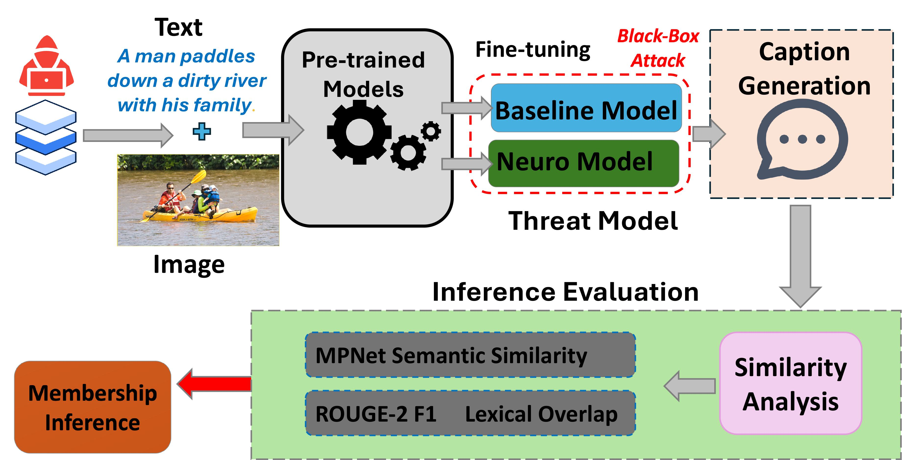

# Neuro-VLM-resilience: Are Neuro-Inspired Multi-Modal Vision-Language Models Resilient to Membership Inference Privacy Leakage?
The growing deployment of multi-modal models (MMs) has introduced new ways for adversaries to access sensitive training data, prompting the need to study privacy leakage. This paper investigates a black-box privacy attack, the Membership Inference Attack (MIA), on Vision-Language Models (VLMs). We present a [Neuroscience-inspired topological regularization (τ) framework](https://toponets.github.io/) to analyze VLM resilience on image-text-based inference privacy attacks. Our main finding is that the neuro VLM variant (where τ > 0) is generally more resilient against privacy attacks, without significantly compromising the model's performance. Our results further show that the MIA success rate drops by 24% on the BLIP model under the COCO dataset, with a mean ROC-AUC. We evaluate three VLMs, [BLIP](https://huggingface.co/docs/transformers/model_doc/blip), [PaliGemma-2](https://huggingface.co/blog/paligemma2), and [ViT-GPT2](https://huggingface.co/nlpconnect/vit-gpt2-image-captioning), on three datasets, [COCO](https://cocodataset.org/), [NoCaps](https://nocaps.org/), and [CC3M](https://github.com/google-research-datasets/conceptual-captions),

under three threat models/τ-regularization levels:

- **BASELINE**: τ = 0  
- **NEURO**: τ = 2  
- **NEURO++**: τ = 3  

We measure similarity using:

- **MPNet** (semantic similarity)
- **ROUGE-2** (lexical overlap)

and report **reference-based MIA performance** (ROC-AUC).
<!--
More details can be found in our paper:
David Amebley, Sayanton Dibbo, "[Are Neuro-Inspired Multi-Modal Vision-Language Models Resilient to Membership Inference Privacy Leakage?](https://arxiv.org/abs/2511.20710)"
-->
Our paper was inspired by and extends the **Reference Inference** attack type by Hu, Yuke, et al. This codebase is also built on top of and extends the original **[Membership Inference Attacks Against Vision–Language Models](https://github.com/YukeHu/vlm_mia)** repository, in particular their **reference-based non-member attack** (`reference_non_member_inference.py`).

## The MIA Pipeline


In the Overview diagram illustrated above, our MIA pipeline consists of four main steps:
1. **VLM Fine-tuning**: fine-tune pre-trained VLMs with topological regularization $(\tau)$
2. **Caption Generation**: models generate captions for member and non-member image-text sets
3. **Similarity Analysis**: compute similarity of generated captions with ground-truth captions using MPNet (semantic) and ROUGE-2 (lexical)
4. **Membership Inference**: perform a black-box membership inference attack

## Performance Comparison among BASELINE and $\tau$-regularized Neuroscience-inspired Models on the COCO Dataset

| Dataset | Model         | Threat Model | MPNet ↓ (Member) | MPNet ↓ (Non-Member) | ROUGE-2 ↓ (Member) | ROUGE-2 ↓ (Non-Member) | ROC-AUC ↑      |
|---------|---------------|--------------|------------------|----------------------|--------------------|------------------------|----------------|
| COCO    | BLIP          | Baseline     | 0.723            | 0.663                | 0.249              | 0.171                  | 94.00 ± 9.90   |
|         |               | Neuro        | 0.797            | 0.793                | 0.425              | 0.380                  | 70.88 ± 18.95  |
|         |               | Neuro++      | 0.698            | 0.687                | 0.319              | 0.312                  | 63.46 ± 10.88  |
|         | PaliGemma 2   | Baseline     | 0.605            | 0.603                | 0.227              | 0.203                  | 70.86 ± 19.53  |
|         |               | Neuro        | 0.717            | 0.712                | 0.111              | 0.102                  | 69.98 ± 13.48  |
|         |               | Neuro++      | 0.735            | 0.732                | 0.338              | 0.318                  | 66.76 ± 13.57  |
|         | ViT-GPT2      | Baseline     | 0.771            | 0.773                | 0.318              | 0.304                  | 55.51 ± 16.47  |
|         |               | Neuro        | 0.773            | 0.782                | 0.357              | 0.373                  | 29.38 ± 10.58  |
|         |               | Neuro++      | 0.775            | 0.776                | 0.357              | 0.368                  | 38.39 ± 10.28  |

<!-- Please see more detailed evaluation and model performance comparison in our [paper](https://arxiv.org/abs/2511.20710). -->

---

## Environment Setup

We recommend using conda to isolate the project's dependencies. An example setup for a CPU or GPU machine looks like this:

```bash
conda create -n neuro-vlm-resilience python=3.10
conda activate neuro-vlm-resilience

# Install PyTorch (adjust CUDA build as needed; shown for CUDA 12.1)
pip install "torch>=2.1.0" "torchvision" --index-url https://download.pytorch.org/whl/cu121

# Install core libraries for VLMs, datasets, and evaluation
pip install \
  transformers \
  sentence-transformers \
  accelerate \
  bitsandbytes \
  datasets \
  pandas \
  numpy \
  matplotlib \
  scikit-learn \
  rouge-score \
  tqdm \
  pillow
```

#### Hugging Face Models
We rely on Hugging Face models for:
- BLIP
- PaliGemma-2
- ViT-GPT2
- MPNet (sentence-transformers/all-mpnet-base-v2)

If you are using models that require auth, log in:
```bash
huggingface-cli login
```

#### Datasets & Preprocessing
**COCO**
Expected layout (relative to repo root):

```bash
data/coco/
├── train2017/
│   ├── 000000000009.jpg
│   ├── ...
└── annotations/
    ├── captions_train2017.json
    └── captions_val2017.json
```

We also maintain COCO-specific experiment splits under:

```bash
experiments/runs/coco/blip/
  ├── train.tsv
  ├── val.tsv
  ├── members400_paths.txt
  ├── nonmembers400_paths.txt
  ├── members400_ids.txt
  └── nonmembers400_ids.txt
```

These split files are pre-committed to the repo and are shared across all three models (BLIP, ViT-GPT2, PaliGemma 2) for COCO. **To reproduce the paper's results, use these files as-is** rather than re-generating the splits.

**NoCaps**
Expected layout:
```bash
data/nocaps/
├── images/
│   └── val/
│       ├── *.jpg
└── captions/
    └── <your_nocaps_captions.json>
```

We also provide a helper to create member / non-member splits and TSVs:
```bash
python experiments/data/nocaps_prepare_splits.py \
  --images_dir data/nocaps/images/val \
  --captions_json data/nocaps/captions/<nocaps_captions.json> \
  --out_dir experiments/runs/nocaps/shared \
  --train_n 360 \
  --val_n 40 \
  --members_n 400 \
  --nonmembers_n 400 \
  --seed 42
```
> This script will create the following files under `experiments/runs/nocaps/shared/`:
- `train.tsv`, `val.tsv`
- `members_paths.txt`, `nonmembers_paths.txt`
- `members_ids.txt`, `nonmembers_ids.txt`
- `members.tsv`, `nonmembers.tsv`, `all_refs.tsv`

> **Note:** The created files will reflect the sizes specified in the script call: 360 images for training, 40 for validation, and 400 images each for the member and non-member sets.

**CC3M**
For CC3M, we use the following helper scripts:
- `experiments/data/cc3m_prepare_tsv.py`
- `experiments/data/cc3m_make_splits.py`

CC3M is accessed via HuggingFace's streaming API. The reference TSV (`all_refs.tsv`) is large and is not committed to the repo; it must be generated before running CC3M experiments.

```bash
# Step 1 — Build the reference TSV (streams from HuggingFace; this may take some time)
python experiments/data/cc3m_prepare_tsv.py \
  --out_tsv experiments/runs/cc3m/shared/all_refs.tsv

# Step 2 — Create member/non-member splits
python experiments/data/cc3m_make_splits.py \
  --all_tsv experiments/runs/cc3m/shared/all_refs.tsv \
  --out_dir experiments/runs/cc3m \
  --seed 42
```

This creates `train.tsv`, `val.tsv`, `members400_paths.txt`, `nonmembers400_paths.txt` and related files under `experiments/runs/cc3m/shared/`.

---
### Running the Core Pipeline
Below, we show an example you can follow and then adapt

**Dataset**: COCO **Model**: BLIP **Threat Model/$\tau$-regularization level**: $\tau$ = 3 (NEURO++)
We assume:
```bash
experiments/runs/coco/blip/
  ├── train.tsv
  ├── val.tsv
  ├── members400_paths.txt
  └── nonmembers400_paths.txt
```

**Fine-tune BLIP with $\tau$ = 3**
```bash
python experiments/train/train_blip_tau.py \
  --train_tsv experiments/runs/coco/blip/train.tsv \
  --val_tsv   experiments/runs/coco/blip/val.tsv \
  --out_dir   experiments/runs/coco/blip/tau3 \
  --epochs 1 \
  --batch_size 16 \
  --lr 1e-5 \
  --tau 3 \
  --device cuda
```
> This will create:
```bash
experiments/runs/coco/blip/tau3/checkpoints/
  ├── config.json
  ├── pytorch_model.bin / safetensors
  └── tokenizer / processor configs
```

**Generate captions for member & non-member sets**
```bash
# Members
python experiments/infer/caption_blip_from_dir.py \
  --ckpt_dir   experiments/runs/coco/blip/tau3/checkpoints \
  --images_txt experiments/runs/coco/blip/members400_paths.txt \
  --out_json   experiments/runs/coco/blip/tau3/captions/blip_member_tau3.json \
  --batch_size 16

# Non-members
python experiments/infer/caption_blip_from_dir.py \
  --ckpt_dir   experiments/runs/coco/blip/tau3/checkpoints \
  --images_txt experiments/runs/coco/blip/nonmembers400_paths.txt \
  --out_json   experiments/runs/coco/blip/tau3/captions/blip_nonmember_tau3.json \
  --batch_size 16
```
> Each JSON file is a list of entries like:
```bash
{
  "image_path": ".../train2017/000000123456.jpg",
  "image_id": "000000123456",
  "caption": "a dog running on the grass"
}
```
**Compute similarity (MPNet & ROUGE-2)**

>We compute similarity against COCO references. This will:
- Use MPNet (sentence-transformers/all-mpnet-base-v2) to compute embedding-based cosine similarities.
- Use ROUGE-2 (bigram F1) for lexical overlap.
- Write per-item similarity JSON used by the attack.
- Append mean stats to `experiments/results/similarity_summary.csv`.

```bash
# Member
python experiments/infer/compute_similarity_blip_coco.py \
  --caps_json experiments/runs/coco/blip/tau3/captions/blip_member_tau3.json \
  --coco_dir  data/coco/annotations \
  --split     member \
  --tau       3 \
  --out_json  experiments/runs/coco/blip/tau3/sim/blip_tau3_member.sim.authors.json

# Non-member
python experiments/infer/compute_similarity_blip_coco.py \
  --caps_json experiments/runs/coco/blip/tau3/captions/blip_nonmember_tau3.json \
  --coco_dir  data/coco/annotations \
  --split     nonmember \
  --tau       3 \
  --out_json  experiments/runs/coco/blip/tau3/sim/blip_tau3_nonmember.sim.authors.json
```

**Run reference-based MIA**

We adapt the reference-based non-member inference from `experiments/reference_non_member_inference.py` and wrap it with `experiments/attack/run_similarity_attack.py`.

We evaluate multiple quantile thresholds (granularity) and metrics (embedding_mpn, rouge2_f):

```bash
# MPNet-based attack
python experiments/attack/run_similarity_attack.py \
  --member_sim   experiments/runs/coco/blip/tau3/sim/blip_tau3_member.sim.authors.json \
  --nonmember_sim experiments/runs/coco/blip/tau3/sim/blip_tau3_nonmember.sim.authors.json \
  --granularity  10,50,100,150,200 \
  --metric       embedding_mpn \
  --temperature  0.1 \
  --append_csv   experiments/results/attack_accuracy.csv \
  --tau          3 \
  --dataset      COCO \
  --model        BLIP

# ROUGE-2-based attack
python experiments/attack/run_similarity_attack.py \
  --member_sim   experiments/runs/coco/blip/tau3/sim/blip_tau3_member.sim.authors.json \
  --nonmember_sim experiments/runs/coco/blip/tau3/sim/blip_tau3_nonmember.sim.authors.json \
  --granularity  10,50,100,150,200 \
  --metric       rouge2_f \
  --temperature  0.1 \
  --append_csv   experiments/results/attack_accuracy.csv \
  --tau          3 \
  --dataset      COCO \
  --model        BLIP
```
>This will append the results rows to `experiments/results/attack_accuracy.csv`. **Note:** Although the attack results are saved in `attack_accuracy.csv`, the actual metric used in the code is **ROC-AUC**.
>You can repeat this pipeline for $\tau \in$ {0, 2, 3} and for other datasets (COCO/NoCaps/CC3M) and models (BLIP, PaliGemma2, ViT-GPT2).

**Other Datasets & Models**

All three models share the same COCO split files (`experiments/runs/coco/blip/train.tsv`, `members400_paths.txt`, etc.). Only the training script, caption script, and similarity script differ per model.

**COCO & ViT-GPT2**
```bash
# Fine-tune
python experiments/train/train_vitgpt2_tau.py \
  --train_tsv experiments/runs/coco/blip/train.tsv \
  --val_tsv   experiments/runs/coco/blip/val.tsv \
  --out_dir   experiments/runs/coco/vitgpt2/tau3 \
  --epochs    1 \
  --batch_size 16 \
  --lr        1e-5 \
  --tau       3

# Generate captions
python experiments/infer/caption_vitgpt2.py \
  --checkpoint_dir experiments/runs/coco/vitgpt2/tau3/checkpoints \
  --image_list     experiments/runs/coco/blip/members400_paths.txt \
  --out_json       experiments/runs/coco/vitgpt2/tau3/captions/vitgpt2_member_tau3.json

python experiments/infer/caption_vitgpt2.py \
  --checkpoint_dir experiments/runs/coco/vitgpt2/tau3/checkpoints \
  --image_list     experiments/runs/coco/blip/nonmembers400_paths.txt \
  --out_json       experiments/runs/coco/vitgpt2/tau3/captions/vitgpt2_nonmember_tau3.json

# Compute similarity
python experiments/infer/compute_similarity_vitgpt2_coco.py \
  --caps_json experiments/runs/coco/vitgpt2/tau3/captions/vitgpt2_member_tau3.json \
  --coco_dir  data/coco/annotations \
  --split     member \
  --tau       3 \
  --out_json  experiments/runs/coco/vitgpt2/tau3/sim/vitgpt2_tau3_member.sim.authors.json

python experiments/infer/compute_similarity_vitgpt2_coco.py \
  --caps_json experiments/runs/coco/vitgpt2/tau3/captions/vitgpt2_nonmember_tau3.json \
  --coco_dir  data/coco/annotations \
  --split     nonmember \
  --tau       3 \
  --out_json  experiments/runs/coco/vitgpt2/tau3/sim/vitgpt2_tau3_nonmember.sim.authors.json
```
Then run `run_similarity_attack.py` with `--model ViT-GPT2` as shown above.

**COCO & PaliGemma 2**

> **Note:** PaliGemma 2's τ-regularization is implemented as label smoothing (clipped to [0, 0.2]) plus logit L2 regularization, rather than the variance penalty on decoder hidden states used by BLIP and ViT-GPT2, because PaliGemma's decoder internals are not directly accessible in the same way.

```bash
# Fine-tune
python experiments/train/train_paligemma_sft.py \
  --train_tsv experiments/runs/coco/blip/train.tsv \
  --val_tsv   experiments/runs/coco/blip/val.tsv \
  --out_dir   experiments/runs/coco/paligemma/tau3 \
  --model_id  google/paligemma2-3b-mix-224 \
  --epochs    1 \
  --lr        1e-5 \
  --tau       3

# Generate captions
python experiments/infer/gen_caps_paligemma.py \
  --ckpt_dir   experiments/runs/coco/paligemma/tau3/checkpoints \
  --paths_file experiments/runs/coco/blip/members400_paths.txt \
  --out_json   experiments/runs/coco/paligemma/tau3/captions/paligemma_member_tau3.json \
  --batch      4

python experiments/infer/gen_caps_paligemma.py \
  --ckpt_dir   experiments/runs/coco/paligemma/tau3/checkpoints \
  --paths_file experiments/runs/coco/blip/nonmembers400_paths.txt \
  --out_json   experiments/runs/coco/paligemma/tau3/captions/paligemma_nonmember_tau3.json \
  --batch      4

# Compute similarity
python experiments/infer/compute_similarity_paligemma_coco.py \
  --caps_json experiments/runs/coco/paligemma/tau3/captions/paligemma_member_tau3.json \
  --coco_dir  data/coco/annotations \
  --split     member \
  --tau       3 \
  --out_json  experiments/runs/coco/paligemma/tau3/sim/paligemma_tau3_member.sim.authors.json

python experiments/infer/compute_similarity_paligemma_coco.py \
  --caps_json experiments/runs/coco/paligemma/tau3/captions/paligemma_nonmember_tau3.json \
  --coco_dir  data/coco/annotations \
  --split     nonmember \
  --tau       3 \
  --out_json  experiments/runs/coco/paligemma/tau3/sim/paligemma_tau3_nonmember.sim.authors.json
```
Then run `run_similarity_attack.py` with `--model PaliGemma2` as shown above.

**CC3M**

After preparing `experiments/runs/cc3m/shared/` as described above, you may run these examples:
- Fine-tune ViT-GPT2:
```bash
python experiments/train/train_vitgpt2_tau.py \
  --train_tsv experiments/runs/cc3m/shared/train.tsv \
  --val_tsv   experiments/runs/cc3m/shared/val.tsv \
  --out_dir   experiments/runs/cc3m/vitgpt2/tau3 \
  --epochs    1 \
  --batch_size 16 \
  --tau       3
```
- Generate captions:
```bash
python experiments/infer/caption_vitgpt2.py \
  --checkpoint_dir experiments/runs/cc3m/vitgpt2/tau3/checkpoints \
  --image_list     experiments/runs/cc3m/shared/members400_paths.txt \
  --out_json       experiments/runs/cc3m/vitgpt2/tau3/captions/vitgpt2_member_tau3.json

python experiments/infer/caption_vitgpt2.py \
  --checkpoint_dir experiments/runs/cc3m/vitgpt2/tau3/checkpoints \
  --image_list     experiments/runs/cc3m/shared/nonmembers400_paths.txt \
  --out_json       experiments/runs/cc3m/vitgpt2/tau3/captions/vitgpt2_nonmember_tau3.json
```

- Compute similarity (member and non-member):
```bash
python experiments/infer/compute_similarity_from_all_tsv.py \
  --caps_json experiments/runs/cc3m/vitgpt2/tau3/captions/vitgpt2_member_tau3.json \
  --all_tsv   experiments/runs/cc3m/shared/all_refs.tsv \
  --split     member \
  --dataset   CC3M \
  --model     ViT-GPT2 \
  --tau       3 \
  --out_json  experiments/runs/cc3m/vitgpt2/tau3/sim/vitgpt2_tau3_member.sim.authors.json

python experiments/infer/compute_similarity_from_all_tsv.py \
  --caps_json experiments/runs/cc3m/vitgpt2/tau3/captions/vitgpt2_nonmember_tau3.json \
  --all_tsv   experiments/runs/cc3m/shared/all_refs.tsv \
  --split     nonmember \
  --dataset   CC3M \
  --model     ViT-GPT2 \
  --tau       3 \
  --out_json  experiments/runs/cc3m/vitgpt2/tau3/sim/vitgpt2_tau3_nonmember.sim.authors.json
```
Then run `run_similarity_attack.py` as before for the final attack step. The same `compute_similarity_from_all_tsv.py` script is used for BLIP and PaliGemma 2 on CC3M, substituting the appropriate caption paths and `--model` value.

**NoCaps & PaliGemma2**
- Fine-tune:
```bash
python experiments/train/train_paligemma_sft.py \
  --train_tsv experiments/runs/nocaps/shared/train.tsv \
  --val_tsv   experiments/runs/nocaps/shared/val.tsv \
  --out_dir   experiments/runs/nocaps/paligemma2/tau3 \
  --model_id  google/paligemma2-3b-mix-224 \
  --epochs    1 \
  --batch_size 16 \
  --tau       3
```

- Generate captions using `gen_caps_paligemma.py`, pointing `--paths_file` to `experiments/runs/nocaps/shared/members400_paths.txt` (and non-members).
- Compute similarity using `compute_similarity_paligemma_nocaps.py`:
```bash
python experiments/infer/compute_similarity_paligemma_nocaps.py \
  --captions_json experiments/runs/nocaps/paligemma2/tau3/captions/paligemma_member_tau3.json \
  --all_tsv       experiments/runs/nocaps/shared/all_refs.tsv \
  --set           member \
  --tau           3 \
  --out_json      experiments/runs/nocaps/paligemma2/tau3/sim/paligemma_tau3_member.sim.authors.json
```
For BLIP and ViT-GPT2 on NoCaps, use `compute_similarity_from_all_tsv.py` with the same `--all_tsv` path and the appropriate `--model` value.
- Run `run_similarity_attack.py` as before.

#### Reproducing Tables & Figures

We aggregate:
 - **Similarity means** (MPNet, ROUGE-2; member vs non-member) from
`experiments/results/similarity_summary.csv`.
 - **Attack performance** (ROC-AUC across quantiles) from
`experiments/results/attack_accuracy.csv`.

We provide table/plot scripts under `experiments/results/`:
```bash
python experiments/results/plot_attack_accuracy_by_dataset.py
python experiments/results/plot_similarity_means_by_dataset.py
python experiments/results/plot_mia_table_dataset.py
python experiments/results/plot_ablation_attack_accuracy.py
```

<!-- <br> **If you find this repository helpful to your research, please consider citing our work:** <br>
```
@article{amebley2025neuro,
  title   = {Are Neuro-Inspired Multi-Modal Vision-Language Models Resilient to Membership Inference Privacy Leakage?},
  author  = {Amebley, David and Dibbo, Sayanton},
  journal = {arXiv preprint arXiv:2511.20710},
  year    = {2025}
}
``` -->